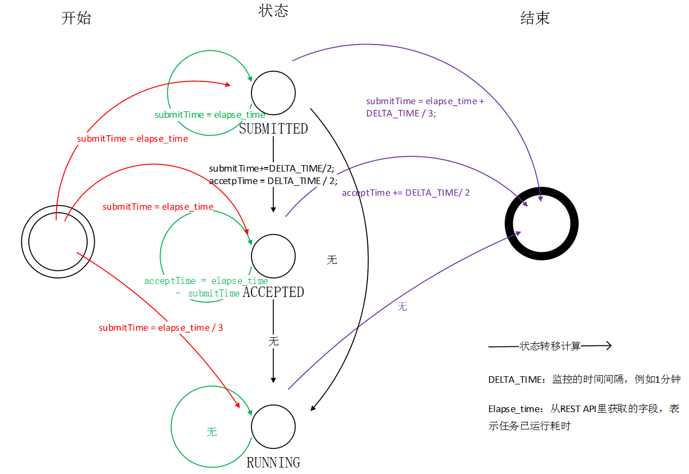

> 本文为工作总结，大致记录参与的项目内容、技术要点和ToFix
> 已屏蔽所有隐私信息，如有其它不妥，请联系作者修改。

## 翻译app与翻译词典

**1.1 原始日志解析**
- 执行方案：
+ 用scala编写`sparkApplication`，打包后在集群上`spark-submit` 提交
- 工作要点：
  + ① 主子ID读配置文件匹配。
  + ② url解码、AES解密、兼容Android、iOS不同日志的格式。
  + ③ 自定义分隔符：字段分隔符、数组分隔符、map分隔符。
  + ④ RDD过滤错误输出。

**1.2 hive统计**
- 执行方案：
  + 用hive SQL对照主子ID分别对count和sum类型做统计
- 工作要点：
  + ① 主子ID配置文件内部表。
  + ② 根据需要展现的click、uv数据进行统计。

**1.3 后续**
- 业务埋点增加要改的地方：
  + ① 日志解析依赖的本地配置更新。
  + ② hive统计依赖的内部表需要更新。
  + ③ 上层展示所需的mysql表需要更新。

- 日志兼容性：
  + 兼容了字段缺失和至多两次URLdecode。其他视为错误日志，输出到同目录的错误标识文件，方便查错。
****

## 问答数据解析

- 执行方案：用scala编写`sparkApplication`，解析python打的日志，打包在集群上用`spark-submit` 提交。
- 工作要点：
  - ① 字段按序解析
  - ② 兼容字段内容缺失
  - ③ 解析错误的日志放到同目录下的错误标识文件，方便查错
- 后续优化：当前是将`log`字段展开为多个字段，后续考虑以K-V(map)形式存储，以便字段扩充
***

## 任务管理器、□□集群、□□集群监控

**3.0 执行的方案**
- 这一部分的内容都是编写`Java`程序来做的；实时的数据通过`REST API`获取的；任务管理器的数据直接读的数据库。
- 实时监控和守护进程：
  + ①	java程序跑在虚机上；
  + ②	crontab每天上午10点执行java -jar /usr/why/TaskMonit/TaskStatistics.jar >> /usr/why/TaskMonit/stdio.log；
  + ③	at now 持续监控：java -jar /usr/why/EarthMonit/EarthStateMonit.jar.99 >> /usr/why/EarthMonit/StateMonitSTDIO.log 2>&1和java -jar /usr/why/EarthMonit/EarthTimeMonit.jar.99 >> /usr/why/EarthMonit/TimeMonitSTDIO.log 2>&1
- 监控数据存放在；

**3.1 任务统计和各集群id关联对应**
- 任务管理器任务的统计：每天上午10点统计昨天的任务。
  - 统计项：task任务、job任务；
  - 数据来源：任务管理器的数据库。
- 集群任务的统计：统计8分钟之前完成的任务，一次统计5分钟时间段，实时监控。
  - 统计项：集群任务；
  - 数据来源：集群的`RMServer REST API`。

**3.2 各阶段耗时监控（earth）**
- 实时监控任务状态改变的方式，获取大致的耗时，`状态转移`图如下。

